# ccusage-viz

[简体中文](README.zh-CN.md) · [Usage guide](docs/usage.md) · [Design philosophy](docs/design-philosophy.md) · [Architecture](docs/architecture.md) · [Versioning](docs/versioning.md)

[](https://pypi.org/project/ccusage-viz/) [](https://pypi.org/project/ccusage-viz/) [](LICENSE) [](https://github.com/Cookie-HOO/ccusage-viz/actions/workflows/ci.yml)

> **Alpha · 0.1.2** — interfaces may change before 1.0. See the [roadmap](ROADMAP.md) for planned work.

`ccusage-viz` is an independent, unofficial terminal visualizer for
[`ccusage`](https://github.com/ryoppippi/ccusage) token data. It turns
`ccusage` command output into interactive terminal charts without creating a
second usage database. `ccusage` is required for real data and is **not**
bundled with this project.

## Product scope

ccusage-viz focuses exclusively on **token consumption** and metrics derived
from token consumption, such as observed tokens per minute (TPM). It does not
provide session analytics, request counts, elapsed-time metrics, costs,
pricing, balances, quotas, allowances, or other non-token account analytics.

> This project is not affiliated with or endorsed by the `ccusage` project or
> its maintainers.

## Dashboard presets

`dashboard` composes independently configured charts in one terminal. Start
with the default overview:

```bash
ccuv dashboard wide
```

### `wide` (default)

A balanced 2×2 overview of Timeline, Stack, Ranking, and Monitor panes.

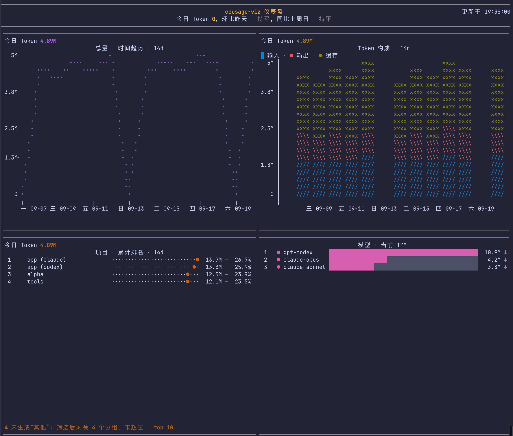

### `narrow`

A compact, vertically focused layout for a narrower terminal.

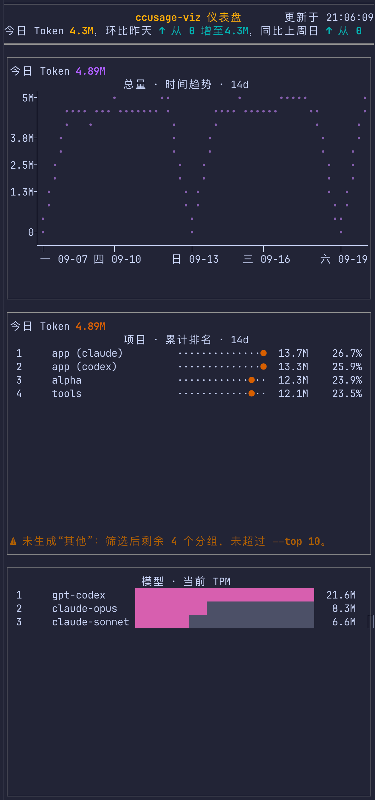

### `all`

A broad gallery that keeps several representative pane forms visible at once.

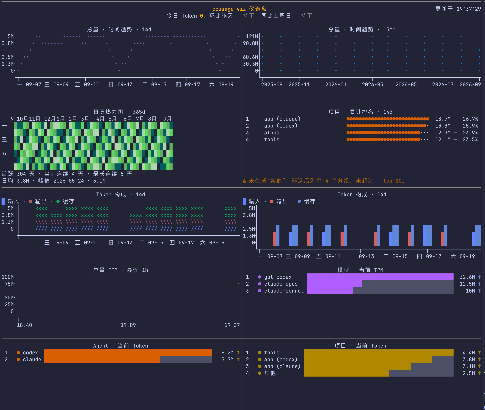

### `spotlight-wide`

Timeline receives the leading full-width row; the remaining panes follow below.

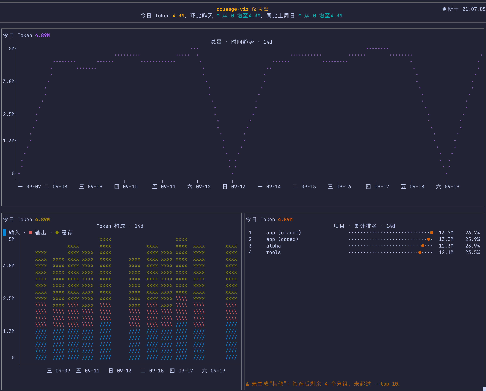

### `spotlight-wide2`

Timeline and Stack receive consecutive full-width rows before the smaller panes.

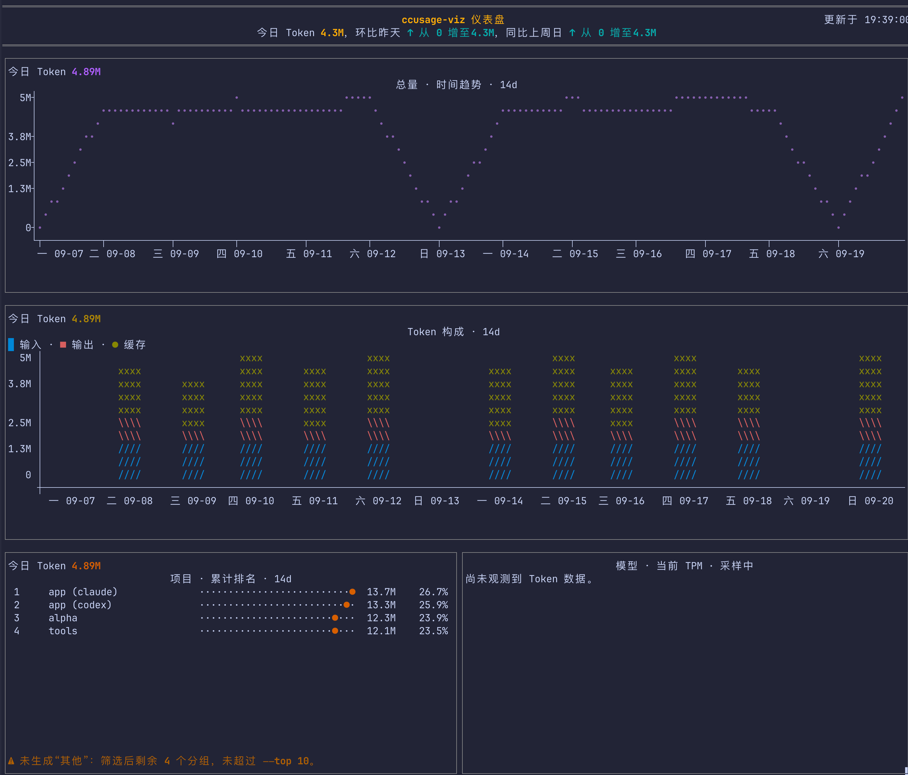

> [!TIP]
> Dashboard coordinates pane queries: identical in-flight provider requests are
> shared, avoiding duplicate work while multiple panes refresh.

## When to use a standalone chart

Choose a standalone view when you need to focus on one question rather than an
overview composed from multiple panes.

### Timeline

Use Timeline for daily token trends, grouped by model, agent, or project:

```bash
ccuv timeline
```

The 14-day view makes recent daily movement easy to compare.

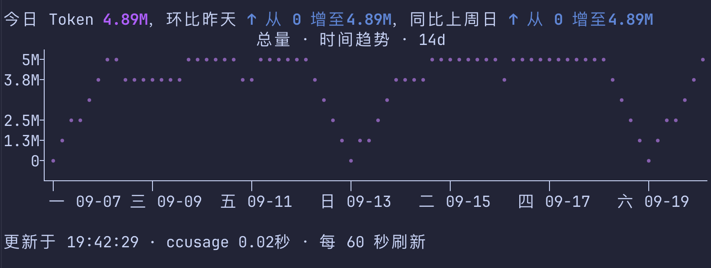

The 13-month view makes longer-term changes visible at a coarser scale.

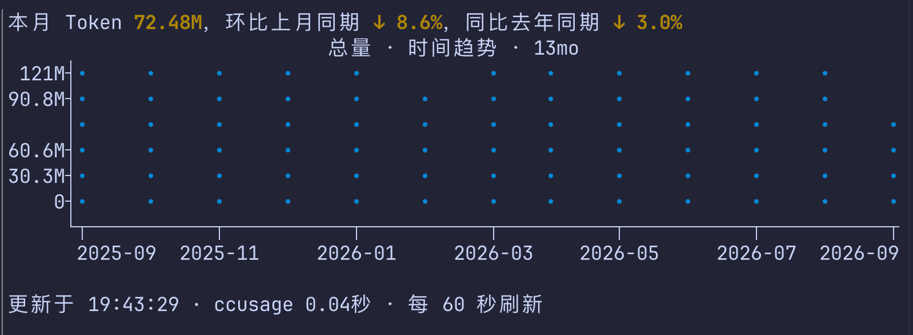

### Calendar

Use Calendar to scan a longer period for active days, streaks, and concentrated
usage:

```bash
ccuv calendar
```

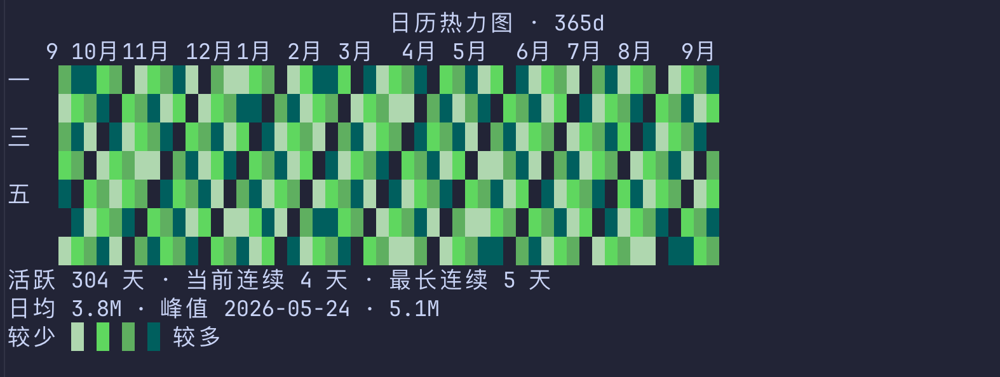

### Stack

Use Stack to compare input, output, and cache-token composition over time:

```bash
ccuv stack --cache split
```

This view emphasizes the overall composition of token types.

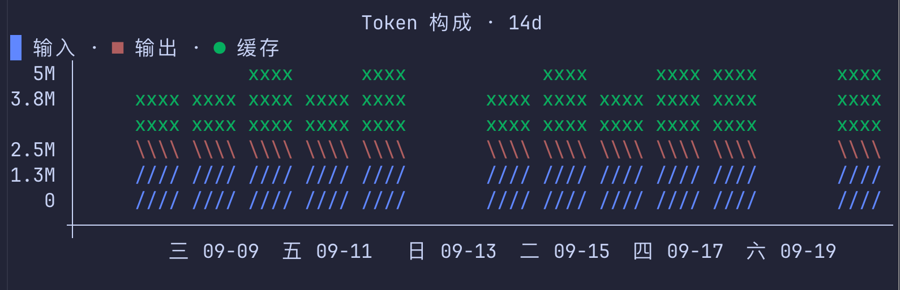

This variation separates cache reads from cache creation.

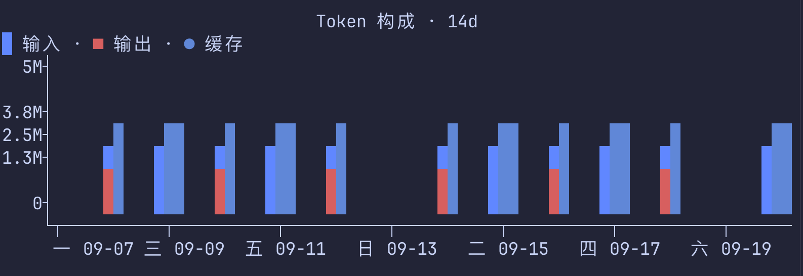

### Ranking

Use Ranking to find the projects, models, or agents with the most tokens in a
range:

```bash
ccuv ranking --by project
```

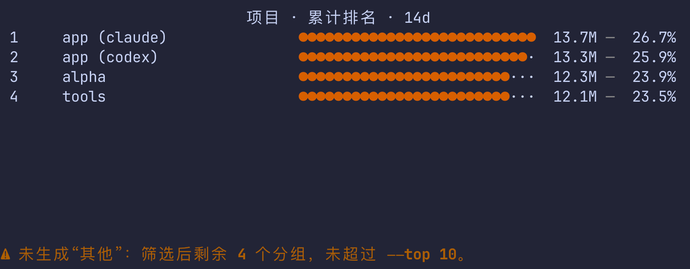

> [!TIP]
> Project Ranking uses conservative **Name** aggregation by default: an unambiguous
> Claude–Codex pair becomes one chart project. Press `v` for its data views: they
> show the safe source rows before aggregation, and equal non-empty `merge_group`
> values identify the rows summed into one chart project. Use
> `--project-aggregation exact` to disable cross-Agent aggregation.

### Project attribution coverage

The compatibility baseline below was verified on macOS with **ccusage 20.0.23**.
“Token totals” means ccusage reports the agent in unified usage data. “Historical
project attribution” requires a stable, real project identity for each record.

| Agent | Token totals | Historical project attribution | Agent version | ccusage version | Evidence |
| --- | --- | --- | --- | --- | --- |
| Claude Code | Verified | Verified | 2.1.278 | 20.0.23 | `claude daily --instances --json` provides project records. |
| Codex | Verified | Verified | 0.139.0 | 20.0.23 | Uses ccusage `cwd`/project fields when present; otherwise resolves only matching local `session_meta.cwd` metadata. |
| OpenCode | Verified | Unsupported (verified) | 1.17.20 | 20.0.23 | Real session output has no project identity field. |
| Antigravity | Verified | Unsupported (verified) | 2.0.10 | 20.0.23 | Real `projectPath` values were the generic constant `Antigravity`, not workspaces. |

Historical project views with OpenCode, Antigravity, or another unsupported agent
show a warning and do not manufacture project rows; that agent's project usage
may therefore be absent or incomplete. Default **Name** project aggregation only
combines an unambiguous Claude–Codex pair; it never merges projects within one
Agent and may use private parent segments only to disambiguate a shared basename.
It does not prove those records came from one checkout. Use **Exact** project
aggregation to keep every source identity separate.

To move an agent to **Verified**, include in the same change a sanitized,
non-empty real-data fixture, parser/provider coverage, project-ranking end-to-end
validation, reconciliation with unified daily token totals, and the exact tested
agent plus ccusage version.

### Monitor

Use Monitor for process-local throughput observed from repeated cumulative
snapshots—not reconstructed hourly history:

```bash
ccuv monitor
```

An observed throughput window starts after a sampling baseline is established. Timeline views mark
this Monitor invocation's start while it remains in the visible window, so time before the mark
means unobserved rather than zero usage. The marker is a line at every density; its label is shown
at full and compact density when space allows. Ranking and list presentations do not show it.

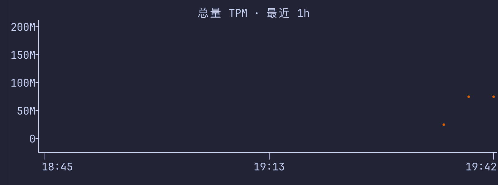

The grouped view ranks the selected dimension within the observed window.

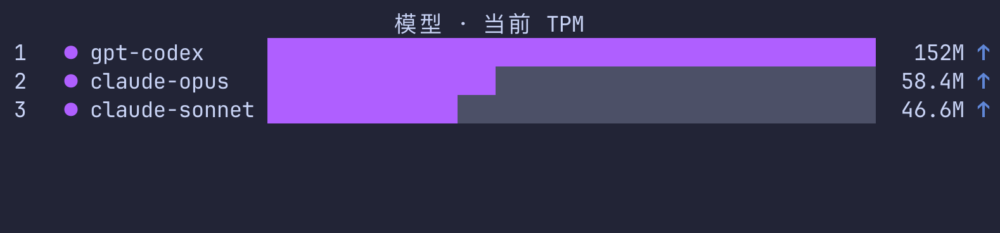

The list view provides process and item detail alongside the observation.


> [!TIP]
> Need several focused charts together? Compose standalone chart commands into a
> custom Dashboard and choose your own grid or named layout. See the
> [usage guide](docs/usage.md).

For commands, filters, controls, styles, and data semantics, see the
[usage guide](docs/usage.md). The [architecture overview](docs/architecture.md)
is intended for maintainers.

## Install, update, and remove

Requires Python 3.11–3.13. `ccuv` is the short alias for `ccusage-viz`; both
installed commands behave the same way.

### From uv

Install the isolated command-line tool:

```bash
uv tool install ccusage-viz
ccuv --version
```

Update or remove it:

```bash
uv tool upgrade ccusage-viz
uv tool uninstall ccusage-viz
```

### From pip

Use an activated virtual environment, then install or update the package:

```bash
python -m pip install --upgrade ccusage-viz
ccuv --version
```

Remove it from that environment:

```bash
python -m pip uninstall ccusage-viz
```

### From source

Clone the repository and install an editable tool:

```bash
git clone https://github.com/Cookie-HOO/ccusage-viz.git
cd ccusage-viz
uv sync --all-groups
uv tool install -e .
ccuv --help
```

After pulling newer source, refresh or remove the editable tool:

```bash
uv tool install --reinstall -e .
uv tool uninstall ccusage-viz
```

### Missing `ccusage`?

Real-data commands need `ccusage` on `PATH` (or an explicit `--ccusage-bin`).
If the default command is missing in an interactive terminal, `ccuv` offers:

```bash
npm install -g ccusage
```

An empty **Enter** or `y`/`Y` confirms that installation. Any other input,
Ctrl-C, or EOF cancels it. Demo mode, redirected/noninteractive runs, and custom
`--ccusage-bin` runs never prompt or install automatically. Install
[`ccusage`](https://github.com/ryoppippi/ccusage) manually when npm is
unavailable.

## Further reading

`ccusage-viz` is token-only and stateless: it does not analyze Agent transcripts,
store a usage database, or calculate cost, quota, QPM, or rate-limit metrics. For Codex
project attribution only, it may read the matching local session's `session_meta.cwd`; it
never stores or displays session-log content.
These documents answer the deeper questions:

| Document | What it answers |
| --- | --- |
| [Usage guide](docs/usage.md) | How do I install, configure, compose, and adjust charts and Dashboards? |
| [Design philosophy](docs/design-philosophy.md) | Which product boundaries, ownership rules, and presentation principles are intentional? |
| [Architecture](docs/architecture.md) | How do CLI routes, hosts, panes, providers, processing, and renderers fit together for maintainers? |
| [Roadmap](ROADMAP.md) | What is planned, deferred, or open for feedback? |
| [Known issues](docs/known-issues.md) | Which intermittent `ccusage` problems are recognized, and how can I recover safely? |

Report reproducible problems with the [bug report form](https://github.com/Cookie-HOO/ccusage-viz/issues/new?template=bug_report.yml), or propose improvements through the [feature request form](https://github.com/Cookie-HOO/ccusage-viz/issues/new?template=feature_request.yml).

Licensed under the [GNU General Public License v3.0 only](LICENSE).
