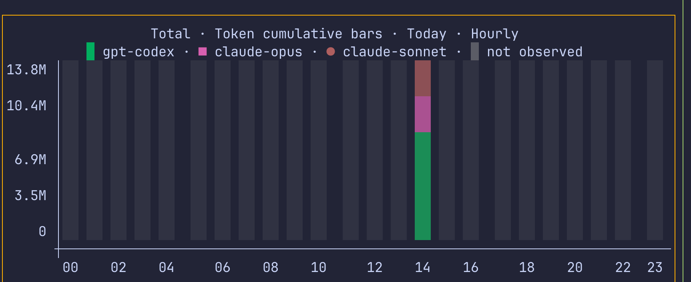

# ccusage-viz

[English](README.md) · [使用指南](docs/usage.zh-CN.md) · [设计哲学](docs/design-philosophy.zh-CN.md) · [架构](docs/architecture.zh-CN.md) · [版本管理](docs/versioning.zh-CN.md)

[](https://pypi.org/project/ccusage-viz/) [](https://pypi.org/project/ccusage-viz/) [](LICENSE) [](https://github.com/Cookie-HOO/ccusage-viz/actions/workflows/ci.yml)

> **Alpha · 0.1.3** — 在 1.0 前接口仍可能变化。规划请见[路线图](ROADMAP.md)。

`ccusage-viz` 是面向 [`ccusage`](https://github.com/ryoppippi/ccusage) Token
数据的独立、非官方终端可视化工具。它把 `ccusage` 命令输出转换为交互式终端图表，
不会额外创建用量数据库。目前真实数据主要依赖 `ccusage`；本项目需要 `ccusage`，且**不内置**它。

## 快速开始

```bash
uv tool install ccusage-viz
ccuv dashboard
```

## 支持的 Agent

Agent 覆盖范围跟随 `ccusage`。其当前支持的 Agent 包括 Claude Code、Codex、OpenCode、Amp、
Droid、Codebuff、Hermes Agent、pi-agent、Goose、OpenClaw、Kilo、Kimi、Qwen、GitHub Copilot CLI、
Gemini CLI、Antigravity、Grok Build CLI 和 ZCode。完整且最新的列表，以及安装和各数据源的细节，
请参阅 [ccusage 支持列表](https://ccusage.com/)。

## 产品边界

ccusage-viz 只关注 **Token 消耗** 与由 Token 消耗直接推导的指标，例如观测到的
每分钟 Token 数（TPM）。它不提供会话分析、调用次数、耗时指标、成本、定价、余额、
额度、配额或其他非 Token 的账户分析。

> 本项目与 `ccusage` 项目及其维护者没有隶属关系，也未获得其背书。

## Dashboard 预设

`dashboard` 将彼此独立配置的图表组合在同一终端中。先从默认总览开始：

```bash
ccuv dashboard wide
```

### `wide`（默认）

```bash
ccuv dashboard wide
```

由 Timeline、Stack、Ranking 和 Monitor Pane 组成的均衡 2×2 总览。


### `narrow`

```bash
ccuv dashboard narrow
```

适合较窄终端的紧凑纵向聚焦布局。


### `all`

```bash
ccuv dashboard all
```

同时展示多种代表性 Pane 形态的宽广画廊布局。


### `spotlight-wide`

```bash
ccuv dashboard spotlight-wide
```

Timeline 位于通栏首行，其余 Pane 位于下方。


### `spotlight-wide2`

```bash
ccuv dashboard spotlight-wide2
```

Timeline 和 Stack 分别占据连续的通栏行，较小的 Pane 位于其后。


> [!TIP]
> Dashboard 会协调 Pane 查询：多个 Pane 刷新时，相同的进行中 Provider 请求会被共享，避免重复工作。

## 什么时候使用独立图表

当你需要聚焦于单一问题，而不是使用由多个 Pane 组成的总览时，请选择独立图表。

### Timeline

用 Timeline 按模型、Agent 或项目分组查看每日 Token 趋势：

```bash
ccuv timeline
```

14 天视图便于比较近期的每日变化。


13 个月视图以更粗的时间尺度展现长期变化。


### Calendar

用 Calendar 在较长时间范围内查看活跃日期、连续天数和用量集中的位置：

```bash
ccuv calendar
```


### Stack

用 Stack 比较输入、输出与缓存 Token 随时间的构成：

```bash
ccuv stack --cache split
```

此视图强调各类 Token 的总体构成。


这个变体将缓存读取与缓存创建分开显示。


### Ranking

用 Ranking 找出指定范围内 Token 使用量最高的项目、模型或 Agent：

```bash
ccuv ranking --by project
```


> [!TIP]
> 项目 Ranking 默认使用保守的 **Name** 聚合：无歧义的 Claude–Codex 配对会成为一个图表项目。按 `v`
> 打开数据视图，可看到聚合前的安全来源行；相同且非空的 `merge_group` 表示这些行会相加为同一个图表项目。
> 使用 `--project-aggregation exact` 可关闭跨 Agent 聚合。

### 项目归因覆盖范围

下方兼容性基线在 macOS 上使用 **ccusage 20.0.23** 完成验证。“Token 总量”指 ccusage
在统一用量数据中报告该 Agent；“历史项目归因”要求每条记录具有稳定、真实的项目身份。

| Agent | Token 总量 | 历史项目归因 | Agent 版本 | ccusage 版本 | 依据 |
| --- | --- | --- | --- | --- | --- |
| Claude Code | 已验证 | 已验证 | 2.1.278 | 20.0.23 | `claude daily --instances --json` 提供项目记录。 |
| Codex | 已验证 | 已验证 | 0.139.0 | 20.0.23 | 优先使用 ccusage 的 `cwd`/项目字段；缺失时仅读取匹配本地 `session_meta.cwd` 元数据。 |
| OpenCode | 已验证 | 不支持（已验证） | 1.17.20 | 20.0.23 | 真实 session 输出没有项目身份字段。 |
| Antigravity | 已验证 | 不支持（已验证） | 2.0.10 | 20.0.23 | 真实 `projectPath` 都是通用常量 `Antigravity`，不是工作目录。 |

历史项目视图若发现 OpenCode、Antigravity 或其他不支持的 Agent，会给出警告，且不会虚构项目记录；
因此该 Agent 的项目用量可能缺失或不完整。默认的 **Name** 项目聚合只会合并无歧义的 Claude–Codex
配对，绝不会合并同一 Agent 内的项目；共享末级名称有歧义时可仅用私有父级片段消歧。它不表示这些记录
来自同一个工作目录。使用 **Exact** 项目聚合可保留每个来源身份。

要将某个 Agent 标为**已验证**，同一改动必须包含脱敏的非空真实数据 fixture、parser/provider 覆盖、
项目 Ranking 端到端验证、与统一 daily Token 总量的核对，以及精确的 Agent 与 ccusage 测试版本。

### Monitor

用 Monitor 通过重复累计快照观察进程内吞吐量，而非重建历史小时活动：

```bash
ccuv monitor
```

观测吞吐量窗口会在建立采样基线后开始。时间线视图会在启动时刻仍位于可见窗口内时，标记
本次 Monitor 运行的启动时刻；标记之前表示未观测，而非零用量。所有密度都会显示边界线；
空间允许时，full 和 compact 密度会显示文字标签。ranking 和 list 视图不显示该标记。


使用累计柱状图可查看本次 Monitor 在本地自然日内保留的 Token 增量，而非 TPM 或重建的历史活动：

```bash
ccuv monitor --style cumulative-bars
```

按 `w` 在今天和昨天之间切换，按 `g` 在每小时和半小时桶之间切换。未观测时段会与已观测的零值明确区分。



分组视图按所选维度在观测窗口内排名。


列表视图会在观测结果旁展示进程和条目详情。


> [!TIP]
> 想将多个聚焦图表一同查看？可以把独立图表命令组合为自定义 Dashboard，并自行选择网格或命名布局。参阅[使用指南](docs/usage.zh-CN.md)。

命令、筛选、控制、样式和数据语义请参阅[使用指南](docs/usage.zh-CN.md)。
[架构文档](docs/architecture.zh-CN.md)面向维护者。

## 安装、更新与卸载

需要 Python 3.11–3.13。`ccuv` 是 `ccusage-viz` 的短别名；两个已安装命令行为相同。

### 从 uv 安装

安装隔离的命令行工具：

```bash
uv tool install ccusage-viz
ccuv --version
```

更新或卸载：

```bash
uv tool upgrade ccusage-viz
uv tool uninstall ccusage-viz
```

### 从 pip 安装

在已激活的虚拟环境中安装或更新：

```bash
python -m pip install --upgrade ccusage-viz
ccuv --version
```

从该环境卸载：

```bash
python -m pip uninstall ccusage-viz
```

### 从源码安装

克隆仓库并安装可编辑工具：

```bash
git clone https://github.com/Cookie-HOO/ccusage-viz.git
cd ccusage-viz
uv sync --all-groups
uv tool install -e .
ccuv --help
```

拉取新版源码后，重新安装或卸载可编辑工具：

```bash
uv tool install --reinstall -e .
uv tool uninstall ccusage-viz
```

### 缺少 `ccusage`？

真实数据命令需要 `PATH` 中的 `ccusage`（或显式指定 `--ccusage-bin`）。在交互式终端中
缺少默认命令时，`ccuv` 会提供：

```bash
npm install -g ccusage
```

直接按空白的 **Enter** 或输入 `y`/`Y` 都会确认安装。输入其他文字、按 Ctrl-C 或发送 EOF
都会取消。Demo、重定向/非交互运行以及自定义 `--ccusage-bin` 运行不会提示或自动安装。
npm 不可用时，请手动安装 [`ccusage`](https://github.com/ryoppippi/ccusage)。

## 延伸阅读

`ccusage-viz` 只关注 Token 且无状态：不会分析 Agent 对话内容，不会保存用量数据库，
也不会计算费用、额度、QPM 或速率限制指标。仅为 Codex 项目归因，它可能读取匹配本地 session 的
`session_meta.cwd`；不会保存或显示 session 日志内容。以下文档回答更深入的问题：

| 文档 | 可以回答什么问题 |
| --- | --- |
| [使用指南](docs/usage.zh-CN.md) | 如何安装、配置、组合和调整图表与 Dashboard？ |
| [设计哲学](docs/design-philosophy.zh-CN.md) | 哪些产品边界、配置归属和呈现原则是刻意的设计？ |
| [架构](docs/architecture.zh-CN.md) | 为维护者说明 CLI 路由、Host、Pane、Provider、处理和渲染如何组织。 |
| [路线图（英文）](ROADMAP.md) | 计划、延后事项和反馈方向是什么？ |
| [已知问题](docs/known-issues.zh-CN.md) | 已识别哪些间歇性 `ccusage` 问题，以及如何安全恢复？ |

可通过[Bug 报告表单](https://github.com/Cookie-HOO/ccusage-viz/issues/new?template=bug_report.yml)提交可复现问题，或通过[功能请求表单](https://github.com/Cookie-HOO/ccusage-viz/issues/new?template=feature_request.yml)提出改进建议。

本项目采用[GNU 通用公共许可证第 3 版（仅限 GPLv3）](LICENSE)。
