# ccusage-viz

[English](README.md) · [使用指南](docs/usage.zh-CN.md) · [设计哲学](docs/design-philosophy.zh-CN.md) · [架构](docs/architecture.zh-CN.md) · [版本管理](docs/versioning.zh-CN.md)

[](https://pypi.org/project/ccusage-viz/) [](https://pypi.org/project/ccusage-viz/) [](LICENSE) [](https://github.com/Cookie-HOO/ccusage-viz/actions/workflows/ci.yml)

> **Alpha · 0.2.0** — 在 1.0 前接口仍可能变化。当前方向请见[路线图](ROADMAP.md)。

`ccusage-viz` 是面向 [`ccusage`](https://github.com/ryoppippi/ccusage) Token
数据的独立、非官方终端可视化工具。它把 `ccusage` 命令输出转换为交互式终端图表，
不会额外创建用量数据库。目前真实数据主要依赖 `ccusage`；本项目需要 `ccusage`，且**不内置**它。

## 快速开始

```bash
uv tool install ccusage-viz
ccuv dashboard
```

## 支持的 Agent

Agent 覆盖范围跟随 `ccusage`。其当前支持的 Agent 包括 Claude Code、Codex、OpenCode、Amp、
Droid、Codebuff、Hermes Agent、pi-agent、Goose、OpenClaw、Kilo、Kimi、Qwen、GitHub Copilot CLI、
Gemini CLI、Antigravity、Grok Build CLI 和 ZCode。完整且最新的列表，以及安装和各数据源的细节，
请参阅 [ccusage 支持列表](https://ccusage.com/)。

## 产品边界

ccusage-viz 只关注 **Token 消耗** 与由 Token 消耗直接推导的指标，例如观测到的
每分钟 Token 数（TPM）。它不提供会话分析、调用次数、耗时指标、成本、定价、余额、
额度、配额或其他非 Token 的账户分析。

> 本项目与 `ccusage` 项目及其维护者没有隶属关系，也未获得其背书。

## Dashboard 预设

`dashboard` 将彼此独立配置的图表组合在同一终端中。默认预设为 `wide-clock`：

```bash
ccuv dashboard
```

| 预设 | 命令 | 布局 | 预览 |
| --- | --- | --- | --- |
| 【推荐-宽终端】 `wide-clock` **（默认）** | `ccuv dashboard wide-clock` | 推荐用于带实时时钟的通用总览。时钟 + 均衡 2×2。 | 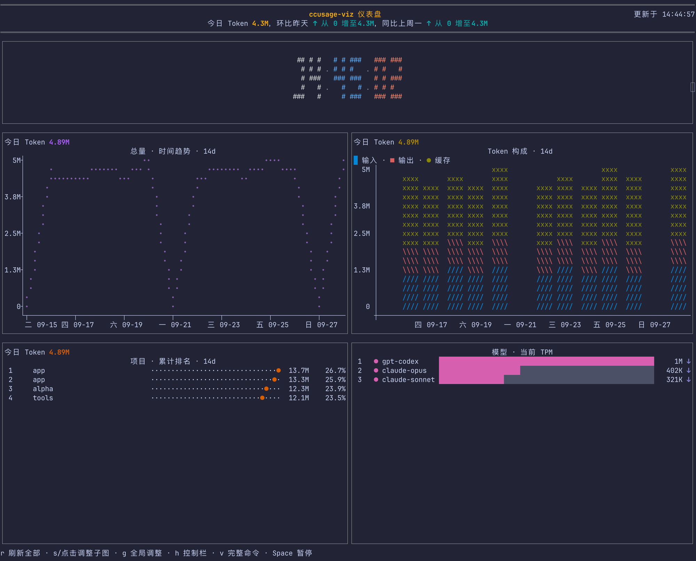 |
| 【推荐-侧边栏】 `narrow-clock` | `ccuv dashboard narrow-clock` | 推荐用于带实时时钟的侧边栏。时钟 + 纵向 4×1。 | 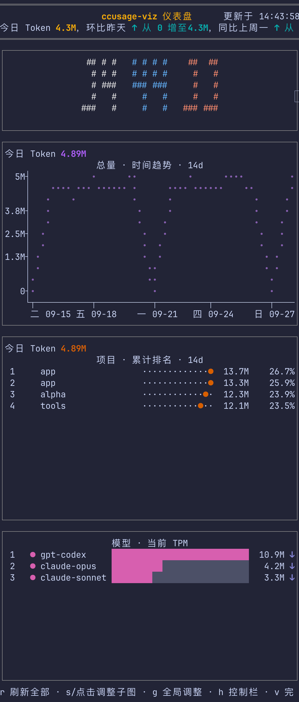 |
| `wide` | `ccuv dashboard wide` | 推荐用于只看数据的均衡总览。均衡 2×2。 | 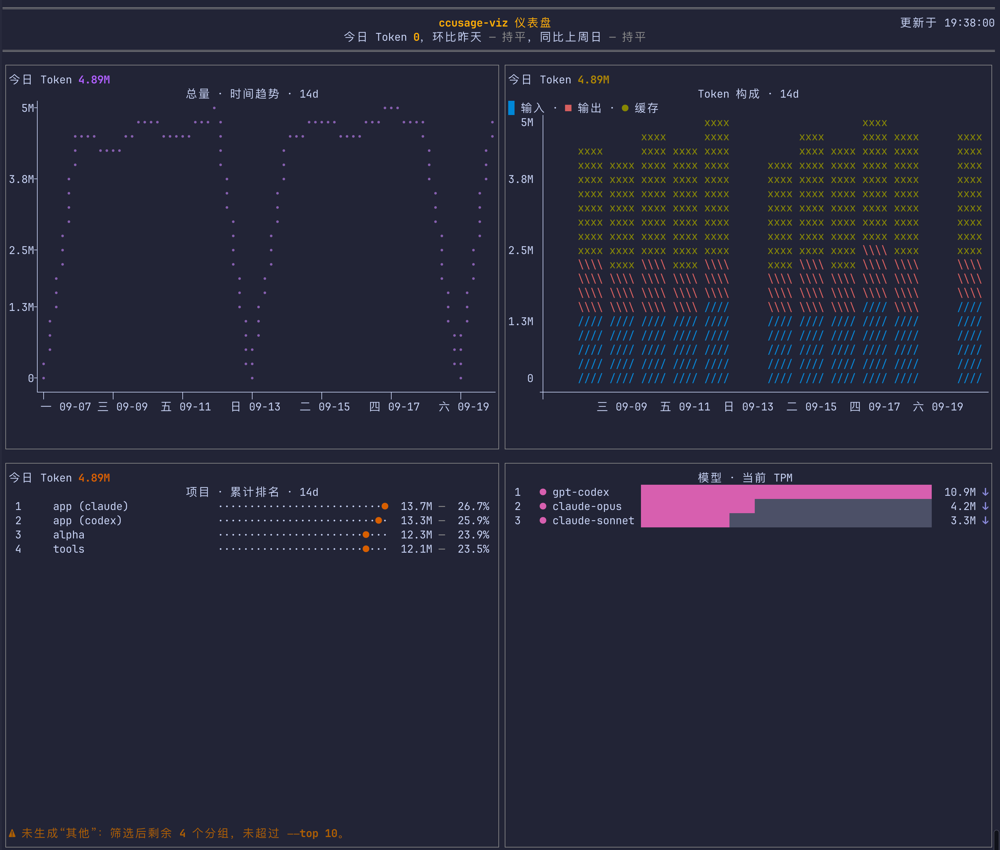 |
| `narrow` | `ccuv dashboard narrow` | 推荐用于窄终端中的紧凑总览。纵向聚焦。 | 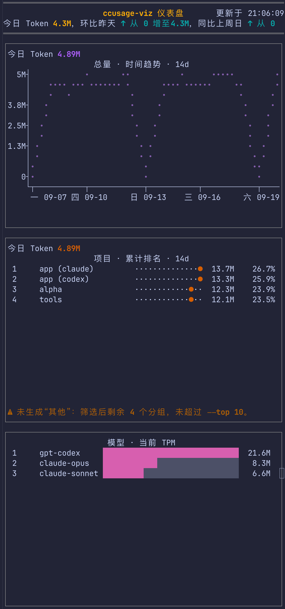 |
| `all` | `ccuv dashboard all` | 推荐用于同时比较多种 Pane。宽广画廊。 | 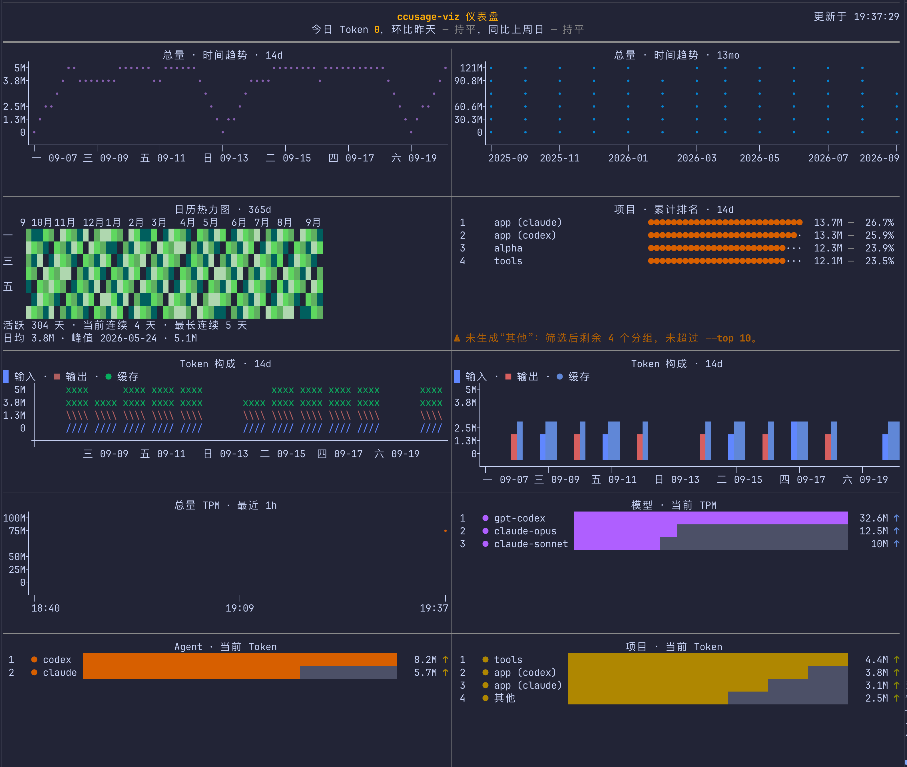 |
| `spotlight-wide` | `ccuv dashboard spotlight-wide` | 推荐用于优先关注 Timeline 趋势。Timeline 主导。 | 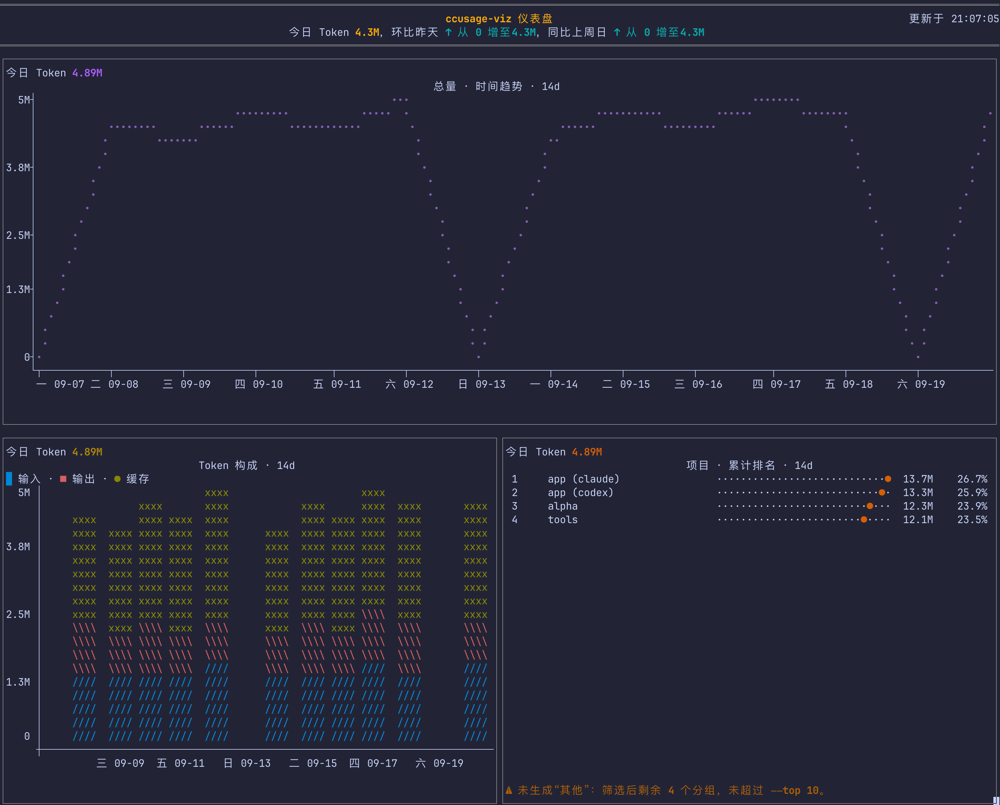 |
| `spotlight-wide2` | `ccuv dashboard spotlight-wide2` | 推荐用于同时优先关注 Timeline 和 Stack。Timeline + Stack 主导。 | 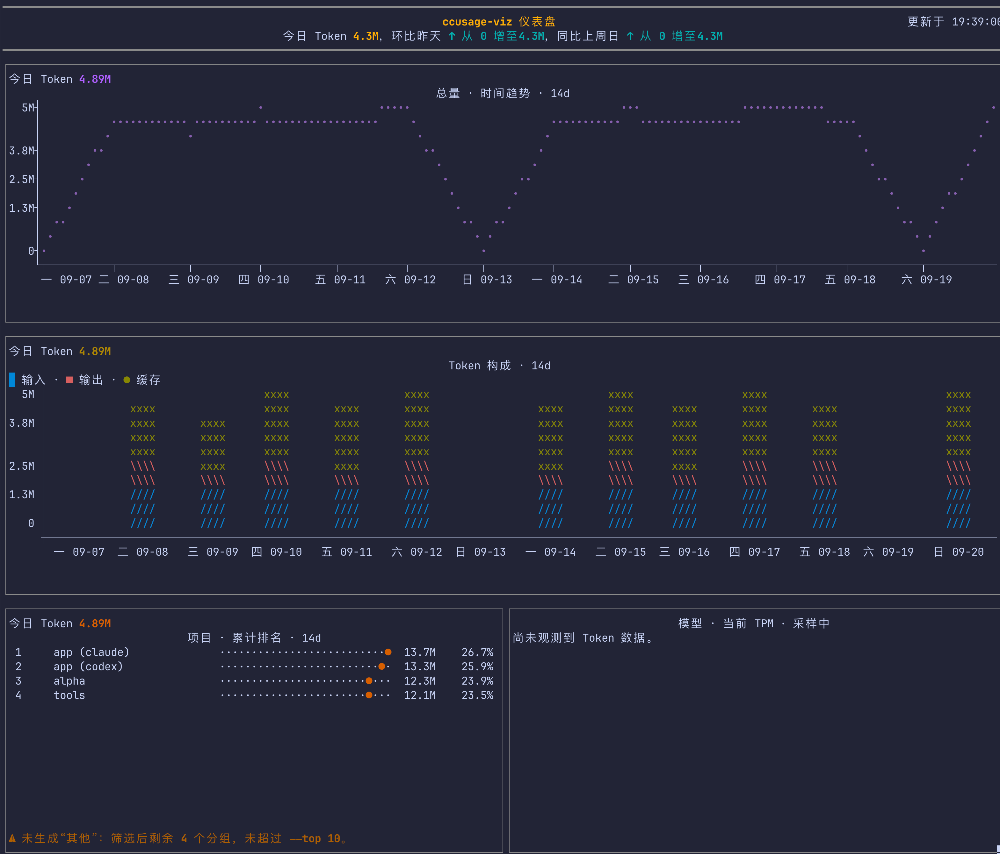 |

> [!TIP]
> Dashboard 会协调 Pane 查询：多个 Pane 刷新时，相同的进行中 Provider 请求会被共享，避免重复工作。

## 独立视图

当你需要聚焦于单一问题，而不是使用由多个 Pane 组成的总览时，请选择独立视图。

| 分类 | 视图 | 命令 | 适用场景 | 预览 |
| --- | --- | --- | --- | --- |
| 趋势分析 `timeline` | Timeline — 14 天 | `ccuv timeline` | 按模型、Agent 或项目分组查看近期每日 Token 趋势。 | 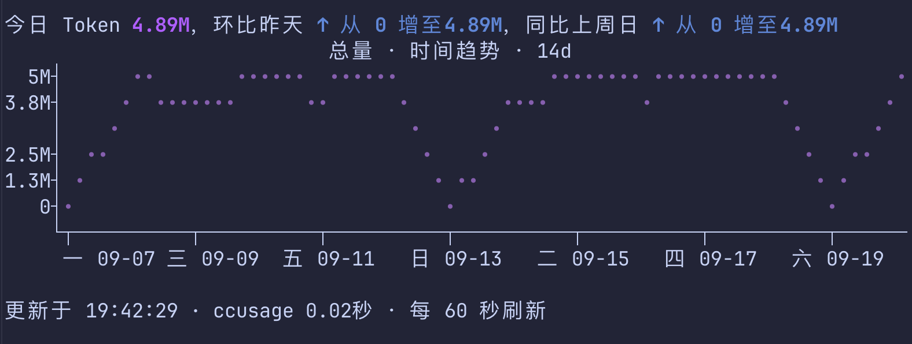 |
| 趋势分析 `timeline` | Timeline — 13 个月 | `ccuv timeline --period 13mo` | 以更粗的时间尺度查看长期变化。 | 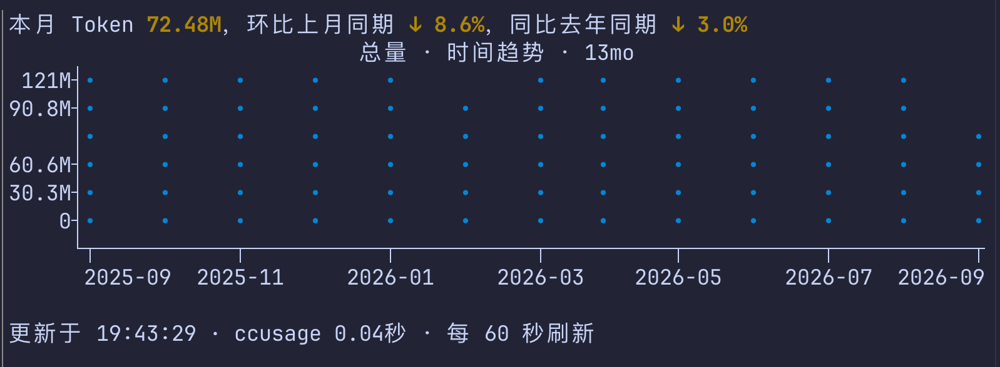 |
| 活跃热力图 `calendar` | Calendar | `ccuv calendar` | 在较长范围内查看活跃日期、连续天数和用量集中的位置。 | 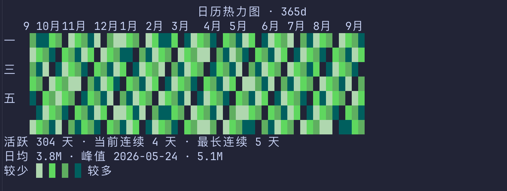 |
| 用量构成 `stack` | Stack — 构成 | `ccuv stack` | 查看输入、输出和缓存 Token 随时间的总体构成。 | 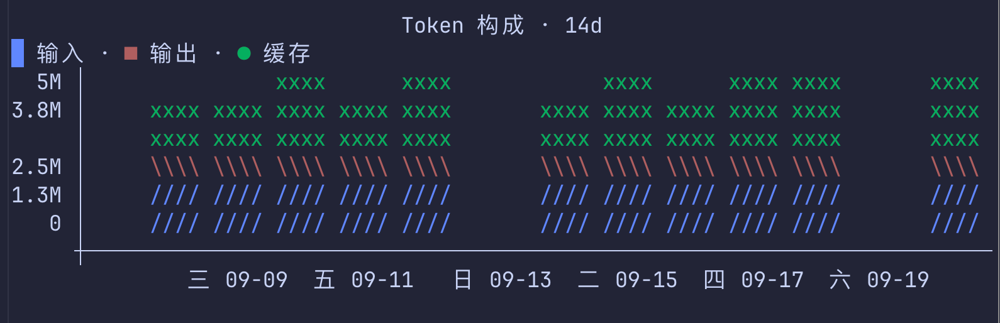 |
| 用量构成 `stack` | Stack — 缓存拆分 | `ccuv stack --cache split` | 比较缓存读取与缓存创建随时间的变化。 | 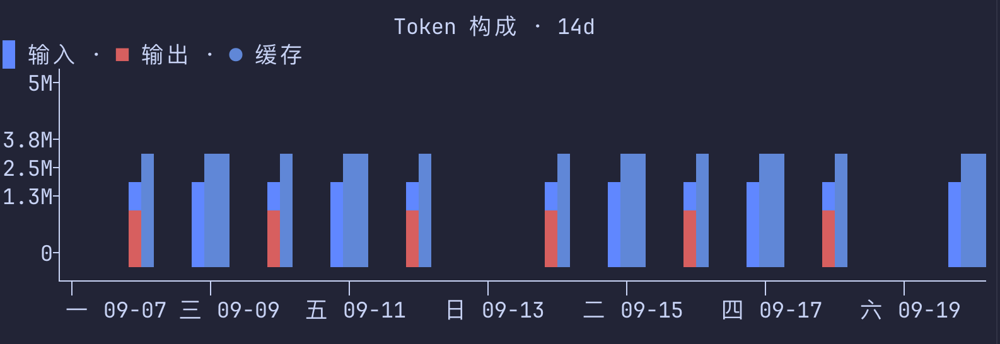 |
| 历史排名 `ranking` | Ranking | `ccuv ranking --by project` | 找出指定范围内 Token 使用量最高的项目、模型或 Agent。 | 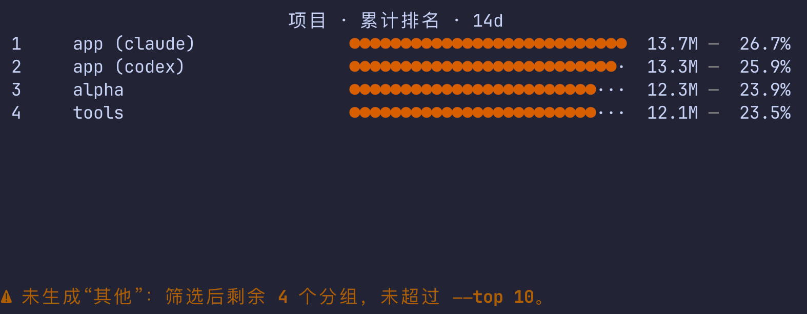 |
| 终端动画 `animate` | 动画画廊 | `ccuv animate --gallery` | 无需 Provider 的纯呈现动画；可选指定初始样式，例如 `ccuv animate digital-clock --gallery`。Space 暂停或继续播放；`m` 打开本地样式和主题控制。 | 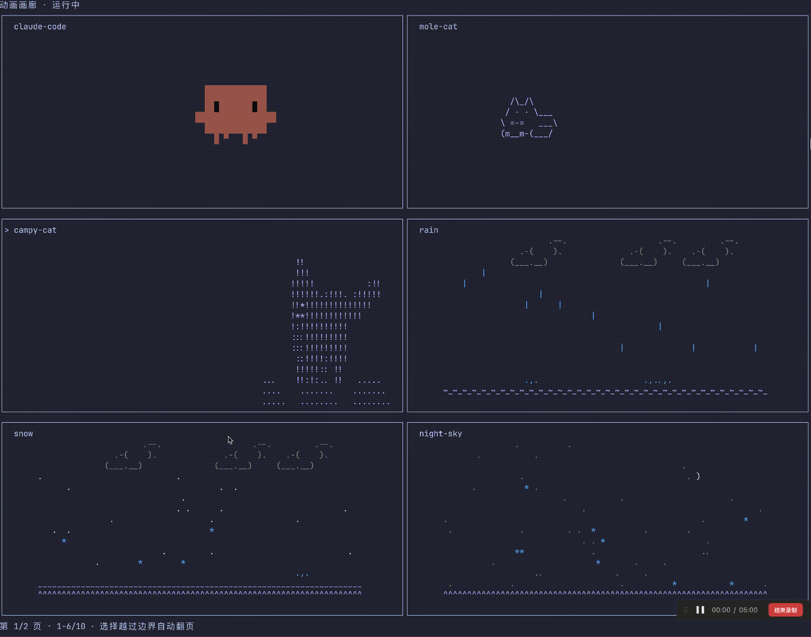 |
| 用量监控 `monitor` | Monitor — 吞吐量 | `ccuv monitor` | 通过重复累计快照观察进程内吞吐量，而非重建历史小时活动。采样基线建立后才开始观测；Timeline 会在可见时标记本次启动时刻。 | 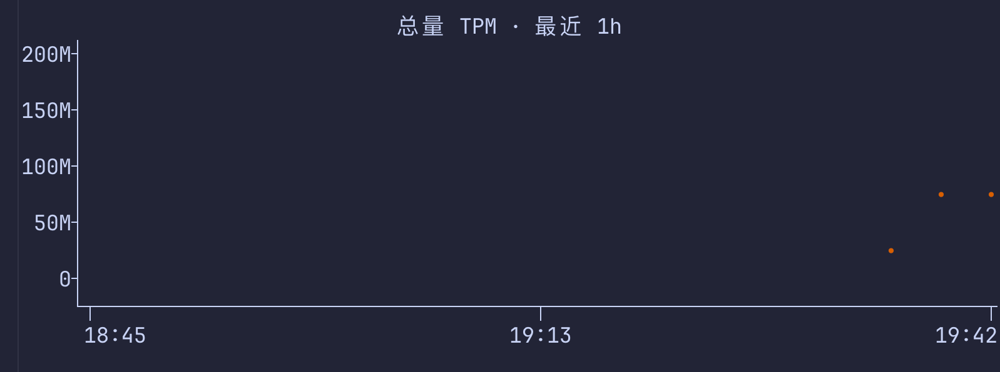 |
| 用量监控 `monitor` | Monitor — 累计柱 | `ccuv monitor --style cumulative-bars` | 查看本地自然日内保留的 Token 增量。按 `w` 切换今天/昨天，按 `g` 切换每小时/半小时桶；未观测时段与已观测零值保持区分。 | 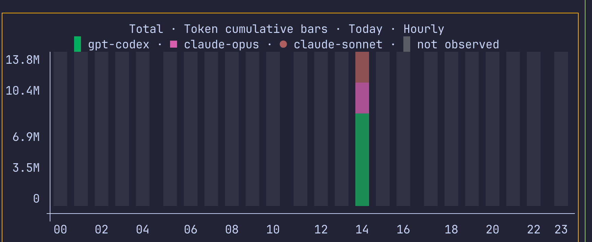 |
| 用量监控 `monitor` | Monitor — 分组 Ranking | `ccuv monitor --by project` | 在观测窗口内按所选维度排名。 | 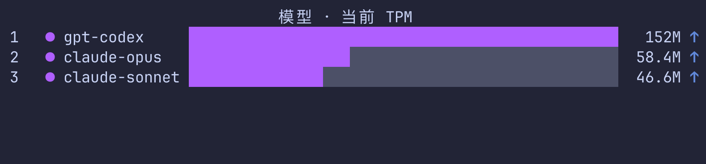 |
| 用量监控 `monitor` | Monitor — 列表 | `ccuv monitor` | 在观测结果旁展示进程和条目详情。 |  |
| 用量监控 `monitor` | Monitor 动画附件 | 在 Monitor `ranking` 或 `list` 中：按 `m`，再按 `s` | 数据下方的可选动画，默认关闭。`s`/`S` 循环适用效果和 ccuv 本地的 `无`；`t`/`T` 仅调整附件主题。它会等待可比较的已接受 interval，且绝不会触发额外用量查询。 | 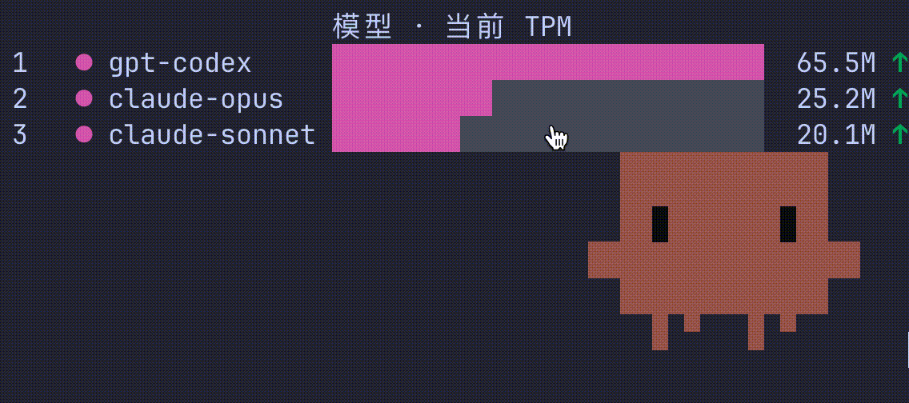 |

> [!TIP]
> 项目 Ranking 默认使用保守的 **Name** 聚合：无歧义的 Claude–Codex 配对会成为一个图表项目。按 `v`
> 打开数据视图，可看到聚合前的安全来源行；相同且非空的 `merge_group` 表示这些行会相加为同一个图表项目。
> 使用 `--project-aggregation exact` 可关闭跨 Agent 聚合。

> [!TIP]
> 想将多个聚焦图表一同查看？可以把独立图表命令组合为自定义 Dashboard，并自行选择网格或命名布局。参阅[使用指南](docs/usage.zh-CN.md)。

命令、筛选、控制、样式和数据语义请参阅[使用指南](docs/usage.zh-CN.md)。
[架构文档](docs/architecture.zh-CN.md)面向维护者。

## 安装、更新与卸载

需要 Python 3.11–3.13。`ccuv` 是 `ccusage-viz` 的短别名；两个已安装命令行为相同。

### 从 uv 安装

安装隔离的命令行工具：

```bash
uv tool install ccusage-viz
ccuv --version
```

更新或卸载：

```bash
uv tool upgrade ccusage-viz
uv tool uninstall ccusage-viz
```

### 从 pip 安装

在已激活的虚拟环境中安装或更新：

```bash
python -m pip install --upgrade ccusage-viz
ccuv --version
```

从该环境卸载：

```bash
python -m pip uninstall ccusage-viz
```

### 从源码安装

克隆仓库并安装可编辑工具：

```bash
git clone https://github.com/Cookie-HOO/ccusage-viz.git
cd ccusage-viz
uv sync --all-groups
uv tool install -e .
ccuv --help
```

拉取新版源码后，重新安装或卸载可编辑工具：

```bash
uv tool install --reinstall -e .
uv tool uninstall ccusage-viz
```

### 缺少 `ccusage`？

真实数据命令需要 `PATH` 中的 `ccusage`（或显式指定 `--ccusage-bin`）。在交互式终端中
缺少默认命令时，`ccuv` 会提供：

```bash
npm install -g ccusage
```

直接按空白的 **Enter** 或输入 `y`/`Y` 都会确认安装。输入其他文字、按 Ctrl-C 或发送 EOF
都会取消。Demo、重定向/非交互运行以及自定义 `--ccusage-bin` 运行不会提示或自动安装。
npm 不可用时，请手动安装 [`ccusage`](https://github.com/ryoppippi/ccusage)。

> [!TIP]
> 已发布的 `ccusage` 包不包含 DeepSeek Harness（DSH）统计。非官方
> [`oksure/ccusage` 的 DSH 分支](https://github.com/oksure/ccusage/tree/contrib/dsh-usage-adapter)
> 提供 `ccusage dsh` 报告，可能与上游产生偏差；ccuv 本身没有 DSH collector。

## 延伸阅读

`ccusage-viz` 只关注 Token 且无状态：不会分析 Agent 对话内容，不会保存用量数据库，
也不会计算费用、额度、QPM 或速率限制指标。仅为 Codex 项目归因，它可能读取匹配本地 session 的
`session_meta.cwd`；不会保存或显示 session 日志内容。以下文档回答更深入的问题：

| 文档 | 可以回答什么问题 |
| --- | --- |
| [使用指南](docs/usage.zh-CN.md) | 如何安装、配置、组合和调整图表与 Dashboard？ |
| [设计哲学](docs/design-philosophy.zh-CN.md) | 哪些产品边界、配置归属和呈现原则是刻意的设计？ |
| [架构](docs/architecture.zh-CN.md) | 为维护者说明 CLI 路由、Host、Pane、Provider、处理和渲染如何组织。 |
| [路线图（英文）](ROADMAP.md) | 计划、延后事项和反馈方向是什么？ |
| [已知问题](docs/known-issues.zh-CN.md) | 已识别哪些间歇性 `ccusage` 问题，以及如何安全恢复？ |

可通过[Bug 报告表单](https://github.com/Cookie-HOO/ccusage-viz/issues/new?template=bug_report.yml)提交可复现问题，或通过[功能请求表单](https://github.com/Cookie-HOO/ccusage-viz/issues/new?template=feature_request.yml)提出改进建议。

本项目采用[GNU 通用公共许可证第 3 版（仅限 GPLv3）](LICENSE)。
